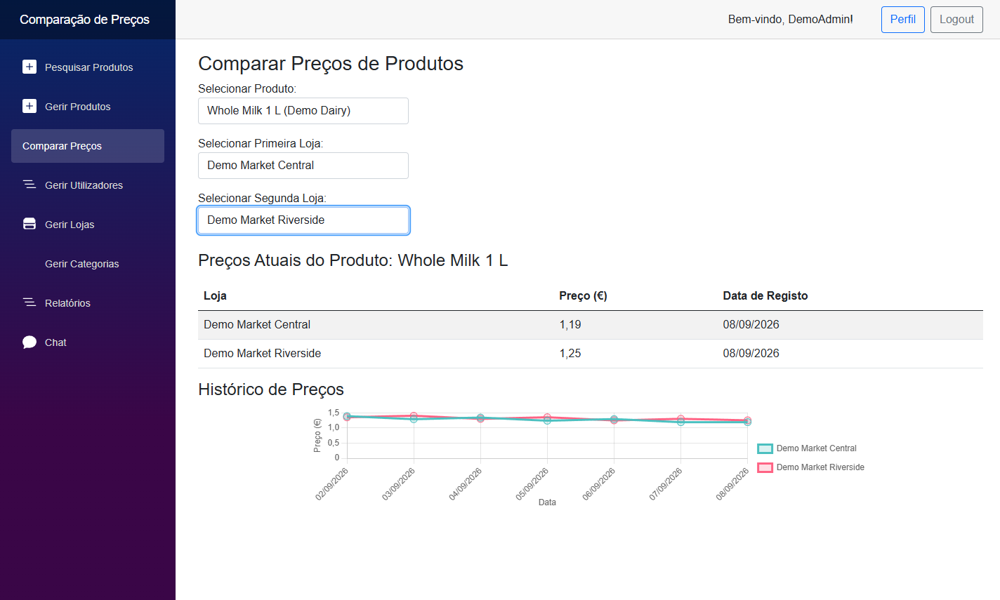
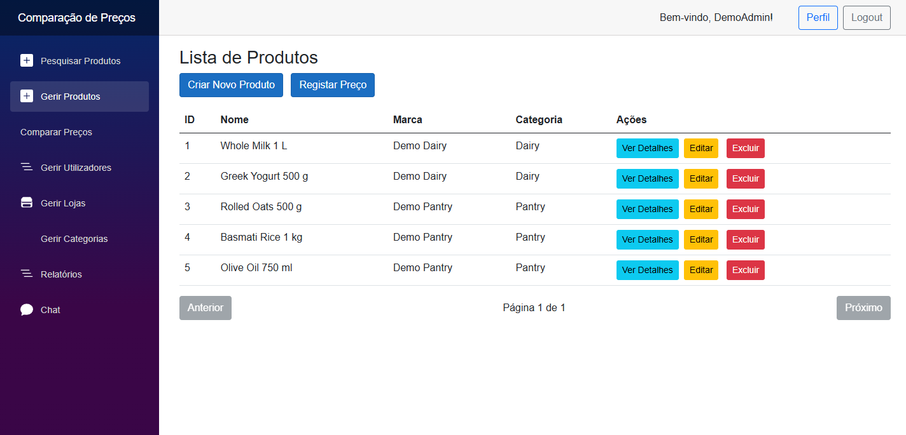

# Price Comparison Platform

A full-stack price comparison platform built with .NET 8, ASP.NET Core, Blazor WebAssembly and PostgreSQL.

The application allows users to explore products, compare prices across stores, track price records, manage favourites and interact with other users through a real-time messaging system.

The project also explores software architecture patterns, authentication, reporting, export strategies and automated testing.



*Real application screenshot using fictional demonstration data. These prices are not live retail offers. See [demo and capture instructions](docs/demo.md) to reproduce it.*

## Features

### Product Catalogue

Users can browse and manage products together with their associated information.

The platform supports:

- product creation
- product editing
- product deletion
- category management
- store management
- product filtering
- product search
- product details
- price records

<details>
<summary>View the product catalogue</summary>



*Administrator view of the running Blazor application, populated with fictional products.*

</details>

### Price Comparison

Products can have price records associated with different stores and locations.

This makes it possible to compare available prices and inspect how product pricing changes across different sellers.

The platform manages entities related to:

```text
Products
Stores
Locations
Price Records
Categories
Users
```

### Price History

Price records are stored independently from the product itself, allowing the application to preserve historical pricing information.

This supports functionality such as:

- current-price comparison
- price-history inspection
- reporting
- aggregated product analysis

### User Authentication

The backend supports token-based authentication using JWT.

Authenticated users can access protected resources while the API validates:

- token signature
- issuer
- audience
- token lifetime

The application also supports external authentication through Google OAuth.

### Role-Based Functionality

The project includes user-role services and user-type entities to support differentiated application permissions and behaviours.

### Favourites

Authenticated users can maintain a list of favourite products for quicker access.

### Comments

The platform includes product-related comment functionality, allowing users to interact with product information beyond simple price comparison.

### Real-Time Messaging

The application includes a SignalR-based messaging system.

Authenticated users can communicate through a real-time hub exposed by the backend.

The architecture includes:

- SignalR Hub
- chat service
- message repository
- message observer registry

The frontend uses the SignalR client to communicate with the real-time backend.

### Reports

The backend provides reporting functionality based on the platform's stored product and pricing data.

Reports can be generated for analytical and administrative use cases.

### Export System

Reports can be exported using a strategy-based architecture.

Supported formats include:

```text
CSV
PDF
```

The export implementation is abstracted behind a common strategy interface, allowing different output formats to be selected without coupling the reporting logic to a specific file type.

### API Documentation

Swagger/OpenAPI documentation is enabled when the backend runs in the development environment.

## Tech Stack

### Backend

- .NET 8
- ASP.NET Core Web API
- C#
- Entity Framework Core
- Npgsql
- PostgreSQL
- SignalR
- JWT Bearer Authentication
- Google OAuth
- Swagger / OpenAPI

### Frontend

- Blazor WebAssembly
- Razor Components
- C#
- Blazored LocalStorage
- Blazored Toast
- SignalR Client

### Architecture

- Repository Pattern
- Factory Pattern
- Strategy Pattern
- Observer Pattern
- Dependency Injection
- DTO-based API communication

### Testing

- API unit tests
- UI tests

## Architecture

```text
┌──────────────────────────────┐
│     Blazor WebAssembly       │
│                              │
│ Pages · Components           │
│ Services · Local Storage     │
└──────────────┬───────────────┘
               │
               │ HTTP / JSON
               ▼
┌──────────────────────────────┐
│     ASP.NET Core Web API     │
│                              │
│ Controllers                  │
│ Authentication               │
│ Business Services            │
│ SignalR Hub                  │
└──────────────┬───────────────┘
               │
               ▼
┌──────────────────────────────┐
│     Application Layer        │
│                              │
│ Services                     │
│ Repository Factory           │
│ Observers                    │
│ Export Strategies            │
└──────────────┬───────────────┘
               │
               ▼
┌──────────────────────────────┐
│   Entity Framework Core      │
│                              │
│ DbContext · Migrations       │
│ Repositories                 │
└──────────────┬───────────────┘
               │
               ▼
┌──────────────────────────────┐
│         PostgreSQL           │
└──────────────────────────────┘
```

## Backend Architecture

The backend separates responsibilities into dedicated layers and components.

### Controllers

API controllers expose functionality related to:

- authentication
- products
- categories
- stores
- locations
- price records
- favourites
- comments
- messages
- reports
- exports
- user management

### Repositories

Data access is abstracted through repository interfaces.

Repositories are created through a central repository factory and injected into the application through ASP.NET Core dependency injection.

Repositories encapsulate reusable data access. Some controllers also query the EF Core context directly for reports, favourites, and comments.

### Repository Factory

The backend registers an `IRepositoryFactory` responsible for constructing repositories for entities such as:

```text
Users
Products
Categories
Stores
Locations
Price Records
Messages
```

This provides a single abstraction for repository creation.

### Services

Business-oriented behaviour is separated into service classes.

Examples include:

- role management
- chat functionality
- report-related behaviour

### Observer Pattern

The messaging architecture includes an observer registry used by the chat system.

This provides a decoupled mechanism for reacting to message-related events.

### Strategy Pattern

Report exports use independent export strategies.

```text
Report Data
    │
    ▼
Report Export Service
    │
    ├────────► CSV Strategy
    │
    └────────► PDF Strategy
```

Additional export formats can be introduced by implementing the shared export strategy interface.

## Authentication Flow

```text
User Login
    │
    ▼
Authentication Endpoint
    │
    ▼
Credential Validation
    │
    ▼
JWT Generation
    │
    ▼
Blazor Client
    │
    ▼
Authenticated API Requests
```

JWT validation includes:

- issuer validation
- audience validation
- lifetime validation
- signing-key validation

Google OAuth provides an additional external-login flow.

## Real-Time Communication

SignalR is used for bidirectional communication between the WebAssembly frontend and backend.

```text
Blazor Client
    │
    │ SignalR
    ▼
ChatHub
    │
    ▼
Chat Service
    │
    ▼
Message Repository
```

The SignalR hub requires authenticated access.

## Data Model

The application is structured around entities including:

```text
User
Product
Category
Store
Location
Price Record
Favourite
Comment
Message
Action Type
User Type
```

Entity Framework Core is used to map the domain model to PostgreSQL.

Database schema evolution is managed through EF Core migrations.

## Project Structure

```text
price-comparison-platform/
├── WebAPI/
│   ├── Context/
│   ├── Controllers/
│   ├── DTOs/
│   ├── Entities/
│   ├── ExportStrategies/
│   ├── Extensions/
│   ├── Factories/
│   ├── Helpers/
│   ├── Hubs/
│   ├── Migrations/
│   ├── Observers/
│   ├── Repositories/
│   ├── Services/
│   ├── Program.cs
│   └── WebAPI.csproj
├── WebApp/
│   ├── Components/
│   ├── Layout/
│   ├── Models/
│   ├── Pages/
│   ├── Services/
│   ├── wwwroot/
│   ├── App.razor
│   ├── Program.cs
│   └── WebApp.csproj
├── tests/
│   ├── WebAPI.UnitTests/
│   └── WebApp.UITests/
├── ES2_TP_ComparadorPrecos.sln
└── README.md
```

## Getting Started

### Requirements

- .NET 8 SDK
- PostgreSQL
- Git

Verify the installed .NET version:

```bash
dotnet --version
```

## Installation

Clone the repository:

```bash
git clone https://github.com/brandao-20/price-comparison-platform.git
cd price-comparison-platform
```

## Database Setup

Create a PostgreSQL database for the application.

Example:

```sql
CREATE DATABASE "ES2";
```

Create the local backend configuration file from the provided example.

macOS / Linux:

```bash
cp WebAPI/appsettings.example.json WebAPI/appsettings.json
```

Windows PowerShell:

```powershell
Copy-Item WebAPI/appsettings.example.json WebAPI/appsettings.json
```

Configure the PostgreSQL connection string.

Example:

```json
{
  "ConnectionStrings": {
    "DefaultConnection": "Host=localhost;Database=ES2;Username=postgres;Password=your_password"
  }
}
```

Do not commit local credentials to the repository. Configure the required JWT settings before starting the API. See [configuration and local validation](docs/configuration.md) for environment variables, optional integrations, and explicit first-administrator bootstrap.

## Restore Dependencies

Restore the backend dependencies:

```bash
dotnet restore WebAPI/WebAPI.csproj
```

Restore the frontend dependencies:

```bash
dotnet restore WebApp/WebApp.csproj
```

## Apply Database Migrations

For a fresh database, run from the repository root. Existing databases with manual schema changes need [migration review](docs/configuration.md#database-and-first-administrator) first.

```bash
dotnet ef database update --project WebAPI/WebAPI.csproj
```

If the Entity Framework CLI is not installed:

```bash
dotnet tool install --global dotnet-ef --version 9.0.3
```

## Run the Backend

```bash
dotnet run --project WebAPI/WebAPI.csproj
```

When running in development mode, Swagger is available through the backend's configured development URL.

## Run the Frontend

Copy `WebApp/wwwroot/appsettings.example.json` to the ignored `WebApp/wwwroot/appsettings.json`. Set `ApiBaseUrl` if the API uses a different address. The optional Google Maps browser key belongs here; backend secrets do not.

Open another terminal and run:

```bash
dotnet run --project WebApp/WebApp.csproj
```

The frontend is configured to run locally at:

```text
http://localhost:5116
```

## Google Authentication

Google OAuth is optional. Leave both Google settings empty to use password login only. To enable Google login, configure valid application credentials and the [middleware callback URL](docs/configuration.md#google-login).

Configure:

```json
{
  "Authentication": {
    "Google": {
      "ClientId": "your_client_id",
      "ClientSecret": "your_client_secret"
    }
  }
}
```

Never commit production OAuth credentials.

## JWT Configuration

JWT settings should be configured locally through application settings or environment-specific configuration.

Example:

```json
{
  "Jwt": {
    "Key": "REPLACE_WITH_A_RANDOM_SECRET_OF_AT_LEAST_32_BYTES",
    "Issuer": "your_issuer",
    "Audience": "your_audience"
  }
}
```

A unique random signing key of at least 32 UTF-8 bytes is required in every environment; placeholders and missing values are rejected. The same validated settings are used for password login, Google login, and bearer validation.

## Testing

The repository contains unit tests for authentication helpers, security/configuration behaviour and export strategies, plus a separate Selenium UI test project.

### API Tests

```bash
dotnet test tests/WebAPI.UnitTests
```

### UI Tests

Start the API and frontend against a disposable migrated PostgreSQL database first. Chrome is required; Selenium Manager resolves a matching driver. Tests create local accounts. See [test prerequisites](docs/configuration.md#tests) for URL overrides and comparison data.

```bash
dotnet test tests/WebApp.UITests
```

### Run Solution Tests

```bash
dotnet test
```

The solution runs the unit test project. Run the Selenium project separately with the command above.

The [hardening and validation record](docs/hardening-review.md) explains the security changes, migration repair, checks performed, and remaining limitations. Screenshot capture is an explicit opt-in test, documented in the [demo guide](docs/demo.md).

## API Development

The API uses:

- controllers
- DTOs
- dependency injection
- repositories
- services
- Entity Framework Core
- JWT authentication
- SignalR

Swagger is enabled in development to simplify API exploration and testing.

## Security Considerations

The application includes authentication and role-aware functionality, but local development settings should not be treated as production configuration.

Before deploying publicly:

- rotate any credentials used by earlier revisions
- keep logs and proxy query strings free of credentials
- configure CORS for the production frontend
- store credentials outside source control
- use HTTPS
- validate OAuth redirect URLs
- protect PostgreSQL credentials
- review authentication and authorization policies

See [security notes](SECURITY.md) for the changes made and the remaining limitations.

## Design Goals

### Separation of Concerns

Controllers, repositories, services, entities and UI logic are separated into dedicated layers.

### Reusable Data Access

Repository interfaces and factories abstract persistence operations from business logic.

### Extensible Reporting

The Strategy pattern allows report-export formats to evolve independently.

### Real-Time Interaction

SignalR provides a dedicated communication channel for live messaging.

### Testability

Backend and frontend test projects are maintained separately from application code.

### Full-Stack .NET

Both API and frontend use the .NET ecosystem while remaining independently structured applications.

## Limitations

- The project is designed primarily as an educational and portfolio application rather than a production retail platform.
- Product and store data depend on the locally configured database.
- Price information is managed within the application and is not automatically scraped from external retailers.
- Google authentication requires external OAuth credentials.
- Deployment infrastructure is not included.
- Development configuration should be hardened before any public deployment.
- JWTs remain in browser local storage; the Google login code store supports a single API instance.
- The help widget is command-based, and the email observer is a simulation.
- Legacy password hashing, login rate limiting, token revocation and price-confirmation abuse controls require further work before a public deployment; see [security notes](SECURITY.md).

## Purpose

This project explores:

- full-stack .NET development
- REST API design
- Blazor WebAssembly
- PostgreSQL persistence
- Entity Framework Core
- authentication and authorization
- real-time communication
- software design patterns
- reporting and exports
- automated testing

It was originally developed in an academic Software Engineering context and is presented here as a portfolio project focused on backend architecture and full-stack .NET development.
